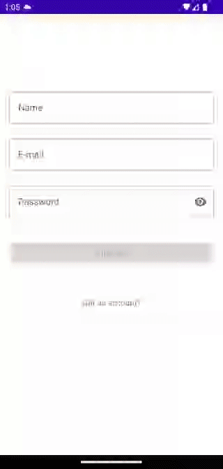
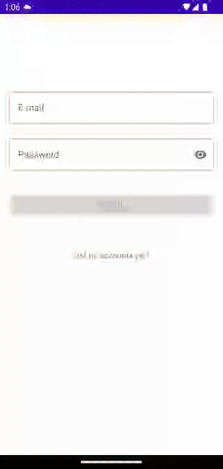
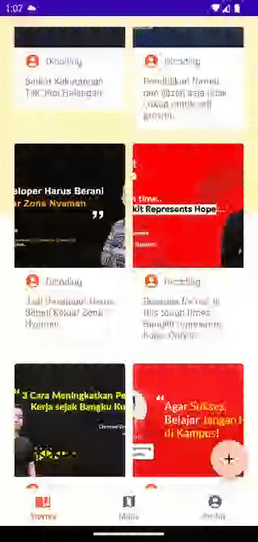

## DStory

A note sharing app based on [Dicoding Story API](https://story-api.dicoding.dev/v1/).

This project is developed as submission for [Dicoding's Belajar Pengembangan Aplikasi Android Intermediate](https://www.dicoding.com/academies/352/).

## Features

- Register
- Sign in
- Notes detail
- Add note
- Maps
- Sign out

## What I use in and learned from this project

- Authentication with preferences
- Retrofit
- Model-view-intent pattern
- Google Maps
- Bottom sheet fragment

## Preview

## License

Licensed under [MIT License](LICENSE)
